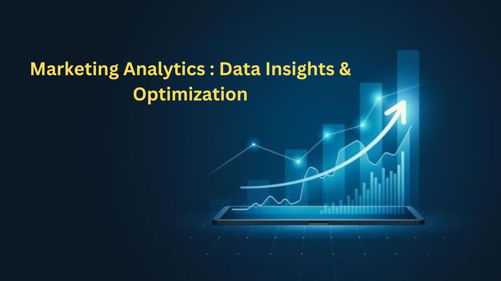

# 📊 Marketing Analytics: Customer Engagement & Conversion Optimization  

## 📖 Introduction  
ShopEasy, an online retail business, faced declining customer engagement and conversion rates despite significant marketing investments. The goal of this project was to analyze marketing performance using **SQL, Python, and Power BI** to provide data-driven recommendations for improving customer engagement, optimizing conversion rates, and enhancing customer satisfaction.
## 🎯 Objectives  
- 📈 **Analyze Conversion Trends**: Identify drop-off points in the customer journey and suggest improvements.  
- 💡 **Enhance Customer Engagement**: Evaluate marketing content performance and recommend content strategies.  
- 😊 **Improve Customer Sentiment**: Extract insights from customer reviews to enhance satisfaction.  
- 🔍 **Data-Driven Decision Making**: Provide actionable insights through **SQL, Python (NLTK), and Power BI dashboards**.  
## 🛠️ Tools & Technologies Used 
- 🗄 **SQL Server**: Data extraction, cleaning, and transformation.  
- 🐍 **Python (pandas, NLTK, pyodbc)**: Sentiment analysis and customer segmentation.  
- 📊 **Power BI**: Data visualization and interactive dashboard creation.  
- ⚙️ **SQL Queries**: Used for data manipulation, joins, and aggregations.  
## 🗄️ SQL: Data Extraction & Cleaning
- **Extracted data** from SQL Server using optimized queries.
- **Removed duplicates and handled missing values** to ensure data integrity.
- **Standardized formats** for consistency (date formats, text casing, and structured categories).
- **Joined multiple tables** (fact_customer_reviews, orders, customers) using `JOINs` to create a unified dataset.
- **Applied CTEs and Window Functions** to rank customers based on spending and review frequency.

---

## 🐍 Python: Sentiment Analysis & Data Processing
- **Used NLTK’s VADER sentiment analysis** to categorize customer reviews as Positive, Neutral, or Negative.
- **Cleaned text data** by removing stopwords, special characters, and normalizing text.
- **Performed customer segmentation** based on sentiment scores and ratings.
- **Analyzed correlations** between customer reviews and conversion trends to identify improvement areas.

---

## 📊 Power BI: Data Visualization & Insights
- **Developed interactive dashboards** to showcase key marketing trends.
- **Created a Conversion Funnel chart** to identify drop-off points in the customer journey.
- **Visualized customer engagement trends** using heatmaps and time-series graphs.
- **Displayed sentiment score distributions** to help understand customer satisfaction trends.
- **Presented insights to stakeholders** with clear, data-driven recommendations.

---
## 🔄 Step-by-Step Workflow & Purpose

### 🗄️ Step 1: Data Extraction & Cleaning (SQL)
**Why?** Raw data often contains inconsistencies, missing values, and redundancies. Cleaning the data ensures accuracy and reliability for analysis.

✅ Extracted data from **SQL Server** using optimized queries.
✅ Removed **duplicates and handled missing values** to maintain integrity.
✅ Standardized formats like **dates, text casing, and structured categories**.
✅ Joined multiple tables (**fact_customer_reviews, orders, customers**) using `JOINs` to unify datasets.
✅ Used **CTEs and Window Functions** to rank customers based on spending and review frequency.

---

### 🐍 Step 2: Sentiment Analysis & Data Processing (Python)
**Why?** Understanding customer sentiment helps in identifying key pain points and areas for improvement.

✅ Used **NLTK’s VADER sentiment analysis** to categorize customer reviews as **Positive, Neutral, or Negative**.
✅ Cleaned text data by **removing stopwords, special characters, and normalizing text**.
✅ Performed **customer segmentation** based on sentiment scores and ratings.
✅ Analyzed correlations between **customer sentiment and conversion trends** to pinpoint major issues.

---

### 📊 Step 3: Data Visualization & Insights (Power BI)
**Why?** Clear, interactive dashboards help stakeholders quickly understand trends and make informed decisions.

✅ Developed **interactive Power BI dashboards** showcasing key marketing insights.
✅ Created a **Conversion Funnel chart** to identify drop-off points in the customer journey.
✅ Visualized **customer engagement trends** using heatmaps and time-series graphs.
✅ Displayed **sentiment score distributions** to highlight satisfaction trends.
✅ Provided **actionable recommendations** based on data-driven insights.
## 📈 Key Insights from Analysis
- 📉 **Conversion Rate Trends**: Identified that conversion rates were lowest in **May (4.3%)** and highest in **January (18.5%)**, indicating seasonal influences.
- 🎯 **Customer Engagement**: Click-through rates (**15.37%**) suggested that while overall engagement declined, users who interacted were still highly engaged.
-  
- 😊 **Customer Sentiment**: **275 positive reviews** highlighted strengths, while **82 negative reviews** indicated concerns around **delivery times and product quality**.  
- 🔍 **Content Performance**: Blog content performed better than social media, suggesting a need to **optimize social content strategies**.  
## 🔄 Overview Analysis  
A detailed breakdown of overview using Power BI:  

 

## 🔄 Conversion Analysis  
A detailed breakdown of Conversion Rate using Power BI:  

## 🔄 Customer Analysis  
A detailed breakdown of Customer Analysis using Power BI:  

## 🔄 SocialMedia Analysis  
A detailed breakdown of SocialMedia Analysis using Power BI:  

---

## 🎯 Recommendations for Improvement
- **Increase Conversion Rates**: Introduce **personalized promotions and discounts** during historically low-performing months.  
- **Enhance Customer Engagement**: Implement **interactive content (videos, user-generated content, and quizzes)** to increase engagement rates.  
- **Improve Customer Feedback Scores**: Address frequent complaints regarding **delivery times and product quality** by refining logistics and product control measures.  
- **Optimize Marketing Strategies**: Focus ad spend on **high-performing content types** and enhance call-to-action placements.  

---

## 📊 Business Impact
- 📌 **Informed Decision-Making**: Provided **data-driven insights** to optimize marketing strategies.  
- 📌 **Higher Engagement**: Suggested **interactive content strategies** to boost user interactions.  
- 📌 **Increased Conversions**: Recommended **seasonal targeting** and better checkout experiences to improve sales.  
- 📌 **Enhanced Customer Satisfaction**: Proposed solutions for common complaints, leading to a potential increase in ratings and customer loyalty.
## 🎯 Conclusion
This project successfully leveraged **SQL, Python, and Power BI** to analyze marketing performance and derive **actionable insights**. By addressing key challenges like **low conversion rates, declining engagement, and customer sentiment issues**, we developed a **data-driven approach to optimize marketing strategies**. The insights and recommendations provided have the potential to drive **higher customer satisfaction, better engagement, and increased revenue** for ShopEasy. 🚀
